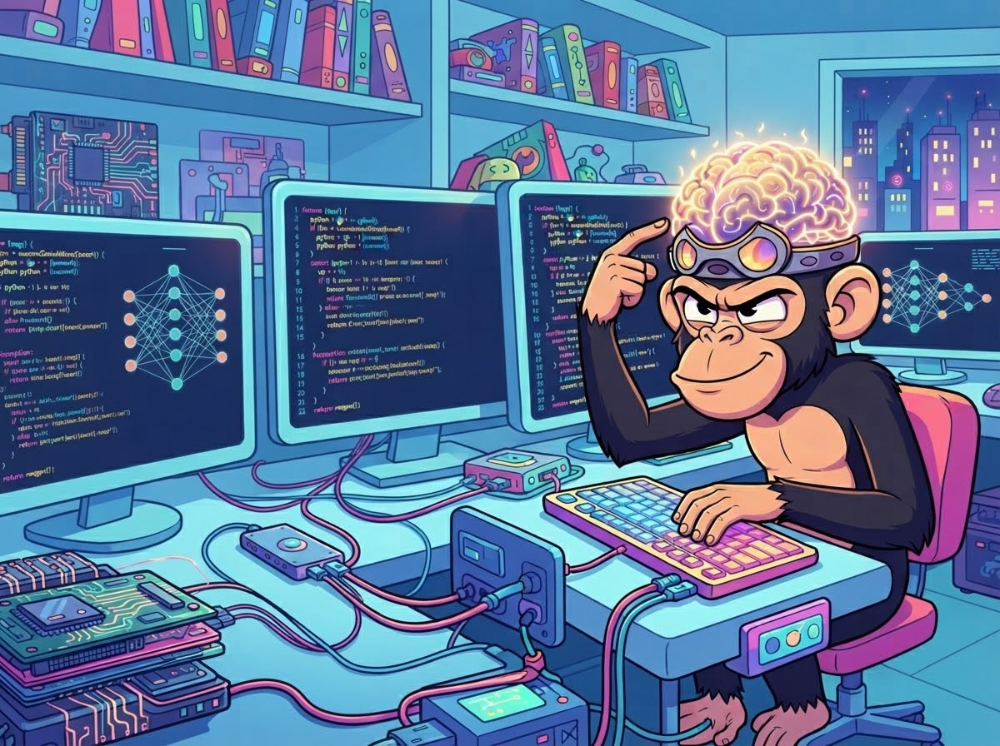

<h1 align="center"> 
  <h1>
  
     Hi, I'm Alhassan Waleed
</h1>
  Hi, I'm Alhassan Waleed</h1>
<h3 align="center">Passionate Computer Science Student & Backend Developer 🚀</h3>

 

## 🔭 Know About Me

- 💻 I'm a Computer Science student at Helwan University diving deep into software development and backend engineering.
- 🧠 By day, I'm mastering data structures, algorithms, and writing clean code in JavaScript, PHP, and C/C++.
- 🛠️ When I'm not building web applications, you can usually find me working on projects like `helpdesk_lite_interface` or managing agile boards.

---

## ⚙️ Tech Stack

  

---

## 📌 Top Projects

- **[helpdesk_lite_interface](https://github.com/Hassanwaleed7/helpdesk_lite_interface)**: A workspace project featuring business requirement documents, agile execution plans, and interactive interfaces.
- **[Hypermarket-Project](https://github.com/Hassanwaleed7/Hypermarket-Project)**: Developed using Java with core programming and system structure design.
- **[Accounting-Company-Project](https://github.com/Hassanwaleed7/Accounting-Company-Project)**: Clean HTML-based structural implementation for company accounting management.

---

## 📊 GitHub Stats

  

---

## connect with me

  
  

> *"Code is never finished. It only becomes slightly less terrible over time."*
